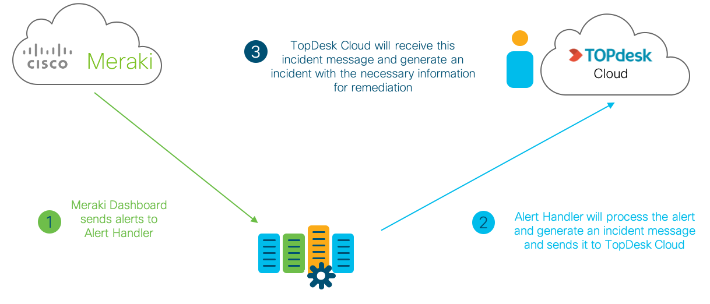
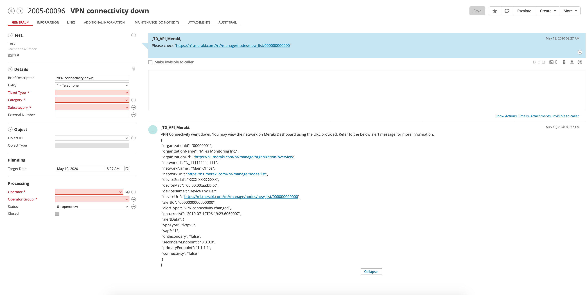

# Meraki and TopDesk Cloud Integration
This is the Meraki TopDesk Cloud Integration source code. Using Meraki Webhooks and Flask, we have developed a connector to initiate incident requests in TopDesk Cloud.



## Contacts:

* Josh Ingeniero (jingenie@cisco.com)
* Monica Acosta (moacosta@cisco.com)

## Solution Components
* Python
* Flask
* Meraki Dashboard API
* Meraki MR Access Points

## Installation:

#### Clone the repo
```
$ git clone https://github.com/gve-sw/meraki-topdesk.git
```

##### Install virtualenv via pip
```
$ pip install virtualenv
```

##### Create a new venv
```
Change to your project folder
$ cd meraki-topdesk

Create the venv
$ virtualenv venv

Activate your venv
$ source venv/bin/activate
```

#### Install dependencies
```
$ pip install -r requirements.txt
```

## Setup:
#### Meraki details :
You can deploy this prototype in a lab environment or on your own Meraki dashboard online [here](https://account.meraki.com/secure/login/dashboard_login).
You need to have a TopDesk App Password and your TopDesk Deployment URL (replace localhost). You may check [here](https://developers.topdesk.com/tutorial.html#show-collapse-usage-createAppPassword) for more info. 

To generate an API KEY, refer to the documentation [here](https://documentation.meraki.com/zGeneral_Administration/Other_Topics/The_Cisco_Meraki_Dashboard_API#Enable_API_access).
You will use this for getting an ORGANIZATION ID, and using this application.

You must select an organization to manage and use its ORGANIZATION ID. You may do so by using Meraki's Postman collection
[here](https://documenter.getpostman.com/view/7928889/SVmsVg6K#18e62fd9-402a-4768-ab5e-f11a44651cfe) and GET the list of organizations,
or use Meraki's API Docs to generate a request [here](https://developer.cisco.com/meraki/api-v1/#!get-organizations).

Fill in the details of your Meraki deployment and TopDesk Cloud in the [DETAILS.py](DETAILS.py) file
```python
MERAKI_API_KEY = 'Your API Key'
MERAKI_ORGANIZATION_ID = 'Your Organization ID'

TOPDESK_USERNAME = 'Your Username'
TOPDESK_PASSWORD = 'Your App Password'
TOPDESK_URL = 'http://localhost/tas/api/incidents'

```

## Usage:

Launch the Alert Handler Server. Make sure that you have your venv activated.
```
$ flask run --host=0.0.0.0 --port=5000
```

You must now expose your Server through an https connection. You may use [ngrok](https://ngrok.com/) for this.
```
$ ngrok http 5000
```

You may also use AWS Lambda and Zappa to host the server. You may refer to [zappa_settings](zappa_settings.json)
for a sample config, and [here](https://pythonforundergradengineers.com/deploy-serverless-web-app-aws-lambda-zappa.html) for a
quick guide on using them.

Setup your Meraki Dashboard settings using this [guide](https://developer.cisco.com/meraki/webhooks/#!introduction/overview)
and use the https endpoint provided by ngrok. TopDesk should now be creating incidents for every alert webhook received.

You may customise the message provided by changing [TopDeskHelper.py](./TopDeskHelper.py).

####Uplink Loss and Latency
You may access the Uplink Loss and Latency Monitoring at IP/stats (for example: http://127.0.0.1:5000/stats)


#### Sample Alert



## License
Provided under Cisco Sample Code License, for details see [LICENSE](./LICENSE.txt)

## Code of Conduct
Our code of conduct is available [here](./CODE_OF_CONDUCT.md)

## Contributing
See our contributing guidelines [here](./CONTRIBUTING.md)
